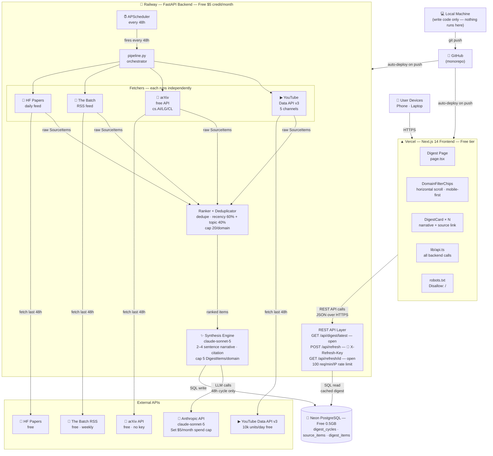
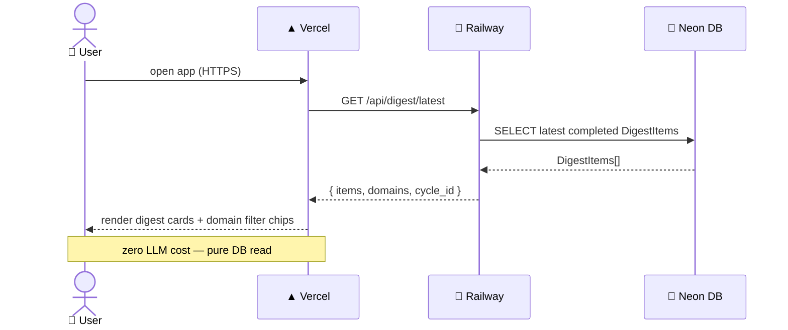
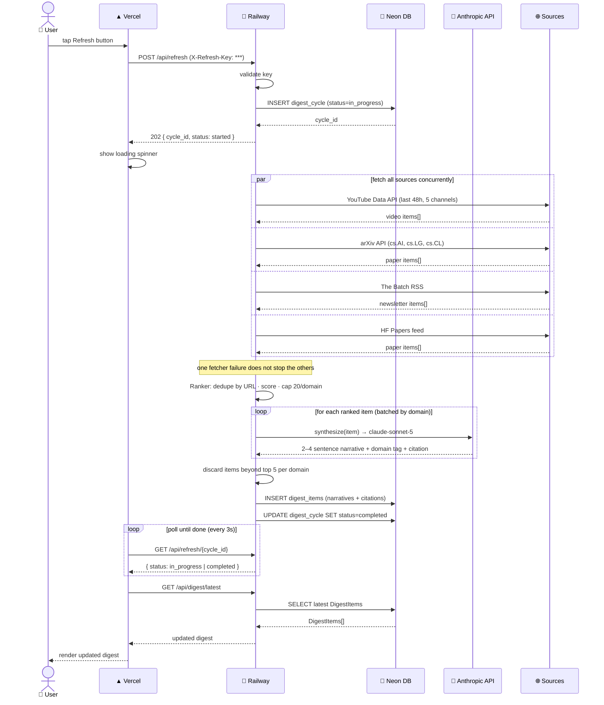
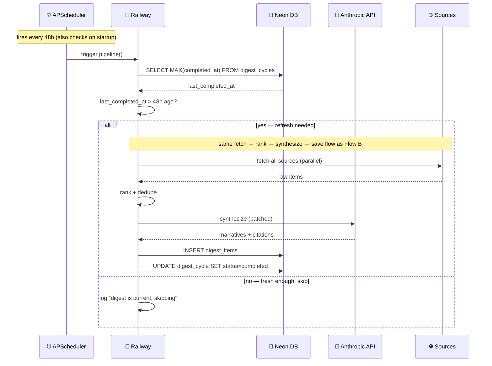

# Frontier Brief — Diagrams

Two diagrams in Mermaid format. Both can be imported into Draw.io:
**Extras → Edit Diagram → (select "Mermaid" tab at bottom) → paste → OK**

---

## 1. System Architecture



---

## 2. Sequence Diagrams

### Flow A — Normal Page Load



### Flow B — Manual Refresh Trigger



### Flow C — Scheduled Refresh (no user action)



---

## How to Import into Draw.io

1. Open [app.diagrams.net](https://app.diagrams.net) (or open Draw.io desktop app)
2. Click **Extras → Edit Diagram**
3. At the bottom of the dialog, click **Close** on the current XML view
4. Or: click the **Mermaid** tab at the bottom of the Edit Diagram dialog
5. Paste the Mermaid code block (without the ` ```mermaid ` fences) 
6. Click **OK**

The `.drawio` file in this folder (`architecture-diagram.drawio`) can be opened directly in Draw.io without any import steps.
